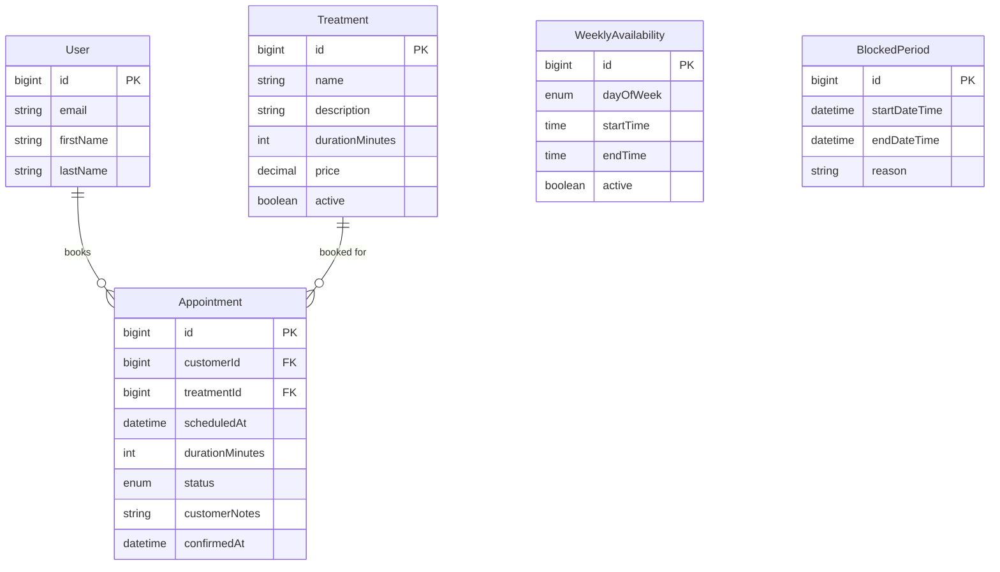

# Design Document: Booking & Appointment System

## Overview

This document describes the technical design for the LMBeauty booking and appointment system backend. The system is built using Spring Boot 4.0 with PostgreSQL, following the existing project architecture patterns. It provides RESTful APIs for treatment management, availability configuration, time slot calculation, and appointment lifecycle management with an owner approval workflow.

## Architecture

The system follows a layered architecture consistent with the existing LMBeauty backend:

```
┌─────────────────────────────────────────────────────────────┐
│                      REST Controllers                        │
│  (TreatmentController, AvailabilityController,              │
│   AppointmentController)                                     │
├─────────────────────────────────────────────────────────────┤
│                       Services                               │
│  (TreatmentService, AvailabilityService,                    │
│   AppointmentService, TimeSlotService)                       │
├─────────────────────────────────────────────────────────────┤
│                      Repositories                            │
│  (TreatmentRepository, AvailabilityRepository,              │
│   BlockedPeriodRepository, AppointmentRepository)            │
├─────────────────────────────────────────────────────────────┤
│                    Database (PostgreSQL)                     │
│  (treatments, weekly_availability, blocked_periods,          │
│   appointments)                                              │
└─────────────────────────────────────────────────────────────┘
```

## Components and Interfaces

### Entities

#### Treatment Entity
```java
@Entity
@Table(name = "treatments")
public class Treatment extends AbstractEntity {
    private String name;                    // Treatment name
    private String description;             // Detailed description
    private Integer durationMinutes;        // Duration in minutes (15-240)
    private BigDecimal price;               // Price in EUR
    private boolean active = true;          // Whether bookable
    private Integer sortOrder;              // Display order
}
```

#### WeeklyAvailability Entity
```java
@Entity
@Table(name = "weekly_availability")
public class WeeklyAvailability extends AbstractEntity {
    private DayOfWeek dayOfWeek;           // MONDAY-SUNDAY
    private LocalTime startTime;            // Start time (e.g., 09:00)
    private LocalTime endTime;              // End time (e.g., 18:00)
    private boolean active = true;          // Whether this slot is active
}
```

#### BlockedPeriod Entity
```java
@Entity
@Table(name = "blocked_periods")
public class BlockedPeriod extends AbstractEntity {
    private LocalDateTime startDateTime;    // Block start
    private LocalDateTime endDateTime;      // Block end
    private String reason;                  // Optional reason (vacation, etc.)
}
```

#### Appointment Entity
```java
@Entity
@Table(name = "appointments")
public class Appointment extends AbstractEntity {
    @ManyToOne
    private User customer;                  // Customer who booked
    
    @ManyToOne
    private Treatment treatment;            // Booked treatment
    
    private LocalDateTime scheduledAt;      // Appointment datetime
    private Integer durationMinutes;        // Snapshot of treatment duration
    
    @Enumerated(EnumType.STRING)
    private AppointmentStatus status;       // PENDING, CONFIRMED, etc.
    
    private String customerNotes;           // Notes from customer
    private String ownerNotes;              // Internal notes
    private String rejectionReason;         // If rejected
    
    private LocalDateTime confirmedAt;      // When confirmed
    private LocalDateTime cancelledAt;      // When cancelled
    private LocalDateTime completedAt;      // When completed
}
```

### Enums

#### AppointmentStatus
```java
public enum AppointmentStatus {
    PENDING,      // Awaiting owner approval
    CONFIRMED,    // Approved by owner
    REJECTED,     // Rejected by owner
    CANCELLED,    // Cancelled by customer or owner
    COMPLETED,    // Service delivered
    NO_SHOW       // Customer didn't show up
}
```

### DTOs

#### Request DTOs
```java
// Treatment management
public record TreatmentRequest(
    String name,
    String description,
    Integer durationMinutes,
    BigDecimal price,
    Boolean active,
    Integer sortOrder
) {}

// Availability management
public record WeeklyAvailabilityRequest(
    DayOfWeek dayOfWeek,
    LocalTime startTime,
    LocalTime endTime,
    Boolean active
) {}

public record BlockedPeriodRequest(
    LocalDateTime startDateTime,
    LocalDateTime endDateTime,
    String reason
) {}

// Appointment booking
public record BookAppointmentRequest(
    Long treatmentId,
    LocalDateTime scheduledAt,
    String customerNotes
) {}

// Appointment actions
public record AppointmentActionRequest(
    String reason  // For rejection or notes
) {}
```

#### Response DTOs
```java
public record TreatmentResponse(
    Long id,
    String name,
    String description,
    Integer durationMinutes,
    BigDecimal price,
    boolean active
) {}

public record TimeSlotResponse(
    LocalDateTime startTime,
    LocalDateTime endTime,
    boolean available
) {}

public record AvailableSlotsResponse(
    LocalDate date,
    List<TimeSlotResponse> slots
) {}

public record AppointmentResponse(
    Long id,
    TreatmentResponse treatment,
    LocalDateTime scheduledAt,
    Integer durationMinutes,
    AppointmentStatus status,
    String customerNotes,
    CustomerSummary customer,  // Only for owner view
    LocalDateTime createdAt,
    LocalDateTime confirmedAt
) {}

public record CustomerSummary(
    Long id,
    String firstName,
    String lastName,
    String email
) {}

public record TreatmentHistoryResponse(
    Long appointmentId,
    String treatmentName,
    LocalDateTime completedAt,
    String notes
) {}
```

### REST API Endpoints

#### Treatment Endpoints
| Method | Path | Description | Auth |
|--------|------|-------------|------|
| GET | `/api/treatments` | List active treatments | Public |
| GET | `/api/treatments/{id}` | Get treatment details | Public |
| POST | `/api/treatments` | Create treatment | OWNER |
| PUT | `/api/treatments/{id}` | Update treatment | OWNER |
| DELETE | `/api/treatments/{id}` | Deactivate treatment | OWNER |

#### Availability Endpoints
| Method | Path | Description | Auth |
|--------|------|-------------|------|
| GET | `/api/availability/weekly` | Get weekly schedule | OWNER |
| POST | `/api/availability/weekly` | Set availability slot | OWNER |
| PUT | `/api/availability/weekly/{id}` | Update slot | OWNER |
| DELETE | `/api/availability/weekly/{id}` | Remove slot | OWNER |
| GET | `/api/availability/blocked` | List blocked periods | OWNER |
| POST | `/api/availability/blocked` | Create blocked period | OWNER |
| DELETE | `/api/availability/blocked/{id}` | Remove blocked period | OWNER |

#### Time Slot Endpoints
| Method | Path | Description | Auth |
|--------|------|-------------|------|
| GET | `/api/slots?treatmentId={id}&date={date}` | Get available slots for date | User |
| GET | `/api/slots/range?treatmentId={id}&from={date}&to={date}` | Get slots for date range | User |

#### Appointment Endpoints
| Method | Path | Description | Auth |
|--------|------|-------------|------|
| POST | `/api/appointments` | Book appointment | User |
| GET | `/api/appointments/my` | Get customer's appointments | User |
| GET | `/api/appointments/my/history` | Get treatment history | User |
| DELETE | `/api/appointments/{id}` | Cancel appointment | User |
| GET | `/api/appointments` | List all appointments | OWNER |
| GET | `/api/appointments/pending` | List pending approvals | OWNER |
| GET | `/api/appointments/schedule?from={date}&to={date}` | Get schedule | OWNER |
| POST | `/api/appointments/{id}/confirm` | Confirm appointment | OWNER |
| POST | `/api/appointments/{id}/reject` | Reject appointment | OWNER |
| POST | `/api/appointments/{id}/complete` | Mark completed | OWNER |
| POST | `/api/appointments/{id}/no-show` | Mark no-show | OWNER |

### Services

#### TreatmentService
- CRUD operations for treatments
- Validation of duration (15-240 minutes, 15-minute increments)
- Soft delete (mark inactive) to preserve history

#### AvailabilityService
- Manage weekly recurring availability
- Manage blocked periods
- Validate no overlapping availability windows

#### TimeSlotService
Core slot calculation logic:
```
calculateAvailableSlots(treatmentId, date):
  1. Get treatment duration
  2. Get weekly availability for day of week
  3. Get blocked periods overlapping the date
  4. Get existing appointments (PENDING/CONFIRMED) for the date
  5. For each availability window:
     a. Generate 15-minute slots
     b. Filter out slots blocked by blocked periods
     c. Filter out slots overlapping existing appointments
     d. Filter out slots where treatment doesn't fit
  6. Return available slots
```

#### AppointmentService
- Create appointments with PENDING status
- Validate slot availability before booking
- Handle status transitions with validation
- Enforce cancellation deadline
- Query appointments by customer, status, date range

## Data Models

### Database Schema

```sql
-- Treatments table
CREATE TABLE treatments (
    id BIGSERIAL PRIMARY KEY,
    name VARCHAR(255) NOT NULL,
    description TEXT,
    duration_minutes INTEGER NOT NULL,
    price DECIMAL(10,2) NOT NULL,
    active BOOLEAN DEFAULT true,
    sort_order INTEGER DEFAULT 0,
    created_at TIMESTAMP DEFAULT CURRENT_TIMESTAMP,
    updated_at TIMESTAMP DEFAULT CURRENT_TIMESTAMP
);

-- Weekly availability
CREATE TABLE weekly_availability (
    id BIGSERIAL PRIMARY KEY,
    day_of_week VARCHAR(20) NOT NULL,
    start_time TIME NOT NULL,
    end_time TIME NOT NULL,
    active BOOLEAN DEFAULT true,
    created_at TIMESTAMP DEFAULT CURRENT_TIMESTAMP,
    updated_at TIMESTAMP DEFAULT CURRENT_TIMESTAMP,
    CONSTRAINT valid_time_range CHECK (start_time < end_time)
);

-- Blocked periods
CREATE TABLE blocked_periods (
    id BIGSERIAL PRIMARY KEY,
    start_date_time TIMESTAMP NOT NULL,
    end_date_time TIMESTAMP NOT NULL,
    reason VARCHAR(500),
    created_at TIMESTAMP DEFAULT CURRENT_TIMESTAMP,
    CONSTRAINT valid_blocked_range CHECK (start_date_time < end_date_time)
);

-- Appointments
CREATE TABLE appointments (
    id BIGSERIAL PRIMARY KEY,
    customer_id BIGINT NOT NULL REFERENCES users(id),
    treatment_id BIGINT NOT NULL REFERENCES treatments(id),
    scheduled_at TIMESTAMP NOT NULL,
    duration_minutes INTEGER NOT NULL,
    status VARCHAR(20) NOT NULL DEFAULT 'PENDING',
    customer_notes TEXT,
    owner_notes TEXT,
    rejection_reason VARCHAR(500),
    confirmed_at TIMESTAMP,
    cancelled_at TIMESTAMP,
    completed_at TIMESTAMP,
    created_at TIMESTAMP DEFAULT CURRENT_TIMESTAMP,
    updated_at TIMESTAMP DEFAULT CURRENT_TIMESTAMP
);

-- Indexes for performance
CREATE INDEX idx_appointments_customer ON appointments(customer_id);
CREATE INDEX idx_appointments_scheduled ON appointments(scheduled_at);
CREATE INDEX idx_appointments_status ON appointments(status);
CREATE INDEX idx_blocked_periods_range ON blocked_periods(start_date_time, end_date_time);
```

### Entity Relationships



## Error Handling

### Custom Exceptions
```java
public class SlotNotAvailableException extends RuntimeException {}
public class AppointmentNotFoundException extends RuntimeException {}
public class InvalidStatusTransitionException extends RuntimeException {}
public class CancellationDeadlinePassedException extends RuntimeException {}
public class OverlappingAvailabilityException extends RuntimeException {}
```

### Error Response Format
```json
{
  "success": false,
  "message": "The requested time slot is no longer available",
  "errorCode": "SLOT_NOT_AVAILABLE",
  "timestamp": "2025-12-27T14:30:00Z"
}
```

## Testing Strategy

### Unit Tests
- TimeSlotService slot calculation logic
- AppointmentService status transition validation
- AvailabilityService overlap detection

### Integration Tests
- Full booking flow: browse treatments → check slots → book → approve
- Cancellation within and outside deadline
- Concurrent booking attempts for same slot

## Configuration

### Application Properties
```properties
# Booking configuration
booking.horizon-days=60
booking.slot-increment-minutes=15
booking.cancellation-deadline-hours=24
booking.min-treatment-duration=15
booking.max-treatment-duration=240
```

## Security Considerations

- All endpoints require JWT authentication (except public treatment listing)
- Owner endpoints protected by role-based access control
- Customers can only access their own appointments
- Input validation on all request DTOs
- Audit logging for appointment status changes
