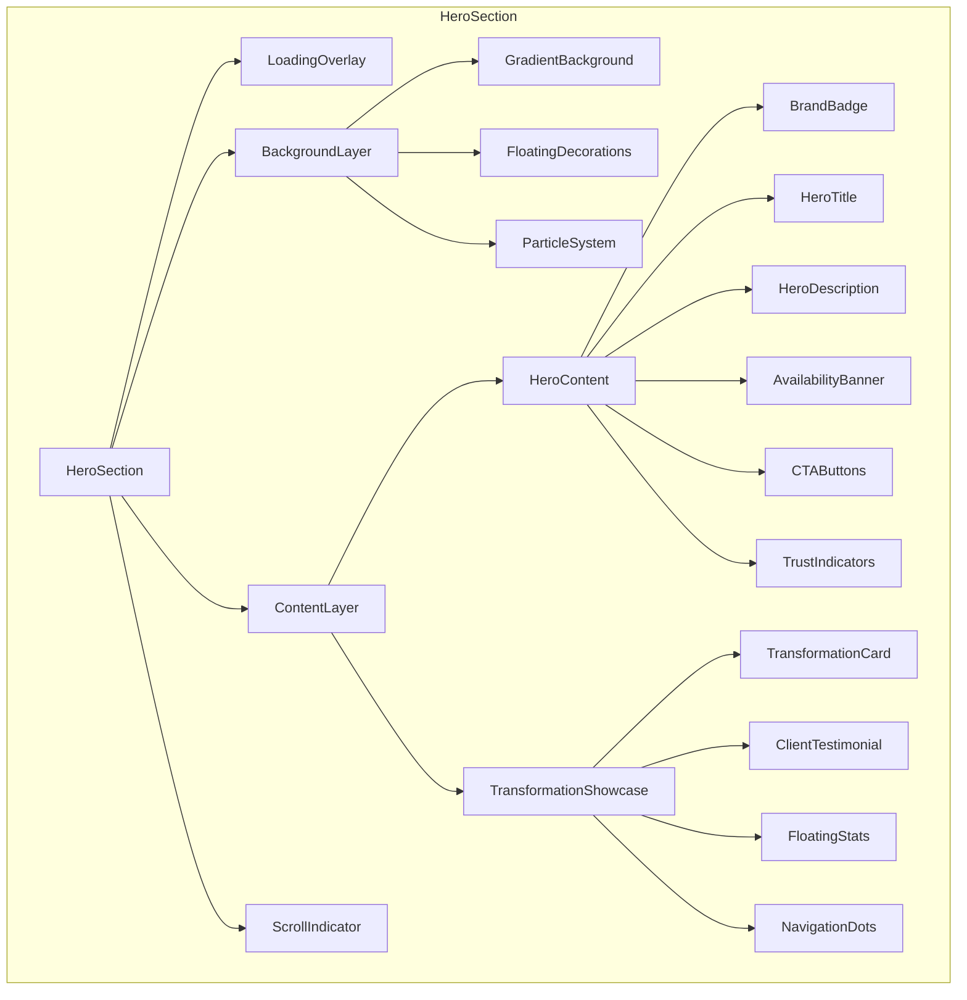

# Design Document: Enhanced Hero Section

## Overview

The Enhanced Hero Section transforms the LM Beauty landing page into an immersive, feminine, and luxurious experience.
Built entirely with Once-UI components, it combines elegant typography, soft gradients, floating decorative elements,
and smooth micro-animations to create an authentic, human-centered design that converts visitors into clients.

## Architecture



## Components and Interfaces

### 1. HeroSection (Main Container)

The root component orchestrating all hero section elements.

```typescript
interface HeroSectionProps {
    // No external props - self-contained component
}

interface HeroState {
    currentSlide: number;
    isVisible: boolean;
    isLoading: boolean;
    isPaused: boolean;
    prefersReducedMotion: boolean;
}
```

**Once-UI Implementation:**

```tsx
<Flex
    position="relative"
    overflow="hidden"
    center
    minHeight="100vh"
    className={styles.heroSection}
>
    {/* Layers */}
</Flex>
```

### 2. LoadingOverlay Component

Premium branded loading experience with animated spinner.

```typescript
interface LoadingOverlayProps {
    isLoading: boolean;
}
```

**Visual Design:**

- Dark gradient background (#0f0f1a → #1a1a2e) with subtle blue/purple glow
- Centered LM Beauty logo/text in white
- Blue/purple gradient spinner ring (3px border, #4d96ff → #bf73ff)
- Animated loading dots with accent color (#bf73ff)
- Fade out animation (400ms)

**Once-UI Implementation:**

```tsx
<Flex
    position="fixed"
    fill
    center
    className={styles.loadingOverlay}
    style={{opacity: isLoading ? 1 : 0}}
>
    <Column center gap="l">
        <div className={styles.spinnerRing}/>
        <Text variant="heading-strong-l" className={styles.brandText}>
            LM Beauty
        </Text>
        <Row gap="xs" className={styles.loadingDots}>
            <span/><span/><span/>
        </Row>
    </Column>
</Flex>
```

### 3. BackgroundLayer Component

Multi-layered background with gradient, decorations, and particles.

```typescript
interface FloatingDecoration {
    id: string;
    type: 'sparkle' | 'heart' | 'petal' | 'circle';
    x: number;
    y: number;
    size: number;
    delay: number;
    duration: number;
}

interface BackgroundLayerProps {
    prefersReducedMotion: boolean;
}
```

**Visual Design:**

- Base gradient: Linear from #0f0f1a (top) to #1a1a2e (bottom) - dark theme
- Radial overlays at 20%, 50%, 80% positions with blue (#4d96ff) and purple (#bf73ff) glows
- 15-20 floating decorations (sparkles, hearts, stars) in brand/accent colors
- Subtle parallax on scroll
- Ambient glow effects using --scheme-brand-600-30 and --scheme-accent-600-30

**Floating Decorations Placement:**

```
┌─────────────────────────────────────┐
│  ✨         💕              ✨      │
│       🌸              ✨           │
│  💕              🌸         💕     │
│         ✨                         │
│  🌸              💕         ✨     │
│       ✨    🌸         💕          │
└─────────────────────────────────────┘
```

### 4. HeroContent Component (Left Column)

Main textual content and CTAs.

```typescript
interface HeroContentProps {
    isVisible: boolean;
}
```

**Sub-components:**

#### 4.1 BrandBadge

```tsx
<Badge
    background="brand-medium"
    textVariant="label-default-s"
    className={styles.heroBadge}
>
    <Icon name="sparkles" size="s"/>
    <Text>Premium Wimpernverlängerung</Text>
</Badge>
```

**Styling:**

- Gradient background: blue (#4d96ff) → purple (#bf73ff)
- White text with subtle glow shadow
- Floating animation (3s ease-in-out infinite)
- Pill shape (border-radius: 50px)
- Subtle glow effect using --scheme-accent-600-30

#### 4.2 HeroTitle

```tsx
<Heading as="h1" variant="display-strong-xl">
    <Text>Dein Moment für</Text>
    <Text className={styles.textHighlight}>Schönheit</Text>
    <Text>und</Text>
    <Text className={styles.textAccent}>Selbstbewusstsein</Text>
</Heading>
```

**Typography:**

- Font: Playfair Display (serif) for elegance
- Size: 4rem desktop / 2.5rem mobile
- Line height: 1.15
- Highlighted words with underline decoration

#### 4.3 AvailabilityBanner

```tsx
<Row
    background="success-alpha-weak"
    border="success-alpha-medium"
    radius="l"
    padding="m"
    gap="s"
    center
>
    <div className={styles.pulsingDot}/>
    <Column gap="4">
        <Text variant="label-strong-s" onBackground="success-strong">
            Nächster Termin verfügbar
        </Text>
        <Text variant="body-default-s" onBackground="neutral-medium">
            Heute 16:30 Uhr - Jetzt buchen!
        </Text>
    </Column>
</Row>
```

#### 4.4 CTAButtons

```tsx
<Column gap="m" fillWidth>
    <Button
        variant="primary"
        size="l"
        prefixIcon="calendar"
        href="/#contact"
        className={styles.primaryCta}
    >
        Jetzt Termin buchen
    </Button>
    <Button
        variant="secondary"
        size="l"
        prefixIcon="play"
        href="/gallery-transformations"
        className={styles.secondaryCta}
    >
        Transformationen ansehen
    </Button>
</Column>
```

#### 4.5 TrustIndicators

```tsx
<Flex wrap gap="s" center>
    <TrustBadge icon="award" text="Zertifizierte Technikerin"/>
    <TrustBadge icon="shield" text="Hygiene-Standards"/>
    <TrustBadge icon="heart" text="50+ Kundinnen"/>
    <TrustBadge icon="star" text="4.9/5 Bewertung"/>
</Flex>
```

### 5. TransformationShowcase Component (Right Column)

Interactive transformation gallery with testimonials.

```typescript
interface TransformationStory {
    id: number;
    image: string;
    title: string;
    description: string;
    clientName: string;
    testimonial: string;
    rating: number;
}

interface TransformationShowcaseProps {
    stories: TransformationStory[];
    currentSlide: number;
    onSlideChange: (index: number) => void;
    onPrev: () => void;
    onNext: () => void;
    isVisible: boolean;
}
```

**Visual Design:**

```
┌─────────────────────────────────────┐
│  ┌─────────────────────────────┐   │
│  │                             │   │
│  │    [Transformation Image]   │   │
│  │                             │   │
│  │  ◀                      ▶   │   │
│  │                             │   │
│  └─────────────────────────────┘   │
│                                     │
│  "Ich liebe meine neuen Wimpern!"  │
│  ⭐⭐⭐⭐⭐ - Sarah M.              │
│                                     │
│         ● ○ ○                       │
│                                     │
│  ┌──────────┐      ┌──────────┐    │
│  │ ⭐ 4.9/5 │      │ ⏱ 2-3h  │    │
│  │ Rating   │      │ Duration │    │
│  └──────────┘      └──────────┘    │
└─────────────────────────────────────┘
```

**Once-UI Implementation:**

```tsx
<Column className={styles.transformationShowcase}>
    {/* Main Card */}
    <Flex
        position="relative"
        radius="xl"
        overflow="hidden"
        className={styles.transformationCard}
    >
        

        {/* Gradient Overlay */}
        <Flex
            position="absolute"
            bottom="0"
            fillWidth
            className={styles.cardOverlay}
        >
            <Column padding="l" gap="s">
                <Text variant="heading-strong-m" onBackground="neutral-strong">
                    {currentStory.title}
                </Text>
                <Text variant="body-default-s" onBackground="neutral-medium">
                    {currentStory.description}
                </Text>
            </Column>
        </Flex>

        {/* Navigation Arrows */}
        <Button
            variant="ghost"
            size="s"
            icon="chevronLeft"
            onClick={onPrev}
            className={styles.navArrowLeft}
        />
        <Button
            variant="ghost"
            size="s"
            icon="chevronRight"
            onClick={onNext}
            className={styles.navArrowRight}
        />
    </Flex>

    {/* Testimonial */}
    <Column padding="m" gap="s" className={styles.testimonialSection}>
        <Text variant="body-default-m" style={{fontStyle: 'italic'}}>
            "{currentStory.testimonial}"
        </Text>
        <Row gap="xs" center>
            <StarRating rating={currentStory.rating}/>
            <Text variant="label-default-s">- {currentStory.clientName}</Text>
        </Row>
    </Column>

    {/* Navigation Dots */}
    <Row gap="xs" center>
        {stories.map((_, index) => (
            <button
                key={index}
                onClick={() => onSlideChange(index)}
                className={`${styles.navDot} ${index === currentSlide ? styles.active : ''}`}
            />
        ))}
    </Row>
</Column>
```

### 6. FloatingStats Component

Floating stat cards positioned around the transformation showcase.

```typescript
interface FloatingStatProps {
    icon: string;
    value: string;
    label: string;
    position: 'top-left' | 'top-right' | 'bottom-left' | 'bottom-right';
    delay?: number;
}
```

**Once-UI Implementation:**

```tsx
<Flex
    position="absolute"
    background="surface"
    radius="l"
    padding="m"
    gap="s"
    border="neutral-alpha-weak"
    className={`${styles.floatingStat} ${styles[position]}`}
>
    <Flex
        background="brand-alpha-weak"
        radius="m"
        padding="s"
        center
    >
        <Icon name={icon} size="m" onBackground="brand-strong"/>
    </Flex>
    <Column gap="4">
        <Text variant="heading-strong-s">{value}</Text>
        <Text variant="label-default-xs" onBackground="neutral-medium">
            {label}
        </Text>
    </Column>
</Flex>
```

### 7. ScrollIndicator Component

Animated scroll prompt at bottom of hero.

```tsx
<Column
    position="absolute"
    bottom="l"
    center
    className={styles.scrollIndicator}
>
    <Icon
        name="chevronDown"
        size="l"
        onBackground="neutral-weak"
        className={styles.bounceAnimation}
    />
</Column>
```

## Data Models

### TransformationStory

```typescript
interface TransformationStory {
    id: number;
    image: string;           // URL to transformation image
    title: string;           // e.g., "Natürliche Volumen-Wimpern"
    description: string;     // Brief technique description
    clientName: string;      // e.g., "Sarah M."
    testimonial: string;     // Client quote
    rating: number;          // 1-5 star rating
}
```

### Sample Data

```typescript
const transformationStories: TransformationStory[] = [
    {
        id: 1,
        image: "https://images.unsplash.com/photo-1616394584738-fc6e612e71b9?w=800&h=600&fit=crop",
        title: "Natürliche Volumen-Wimpern",
        description: "Klassische Technik für den alltäglichen Look",
        clientName: "Sarah M.",
        testimonial: "Ich liebe meine neuen Wimpern! Sie sehen so natürlich aus.",
        rating: 5
    },
    {
        id: 2,
        image: "https://images.pexels.com/photos/3993449/pexels-photo-3993449.jpeg?w=800&h=600&fit=crop",
        title: "Dramatische Hybrid-Extensions",
        description: "Perfekt für besondere Anlässe",
        clientName: "Maria K.",
        testimonial: "Lisa Marie ist eine wahre Künstlerin! Absolut empfehlenswert.",
        rating: 5
    },
    {
        id: 3,
        image: "https://images.unsplash.com/photo-1522337360788-8b13dee7a37e?w=800&h=600&fit=crop",
        title: "Mega-Volumen Wimpern",
        description: "Für den ultimativen Glamour-Look",
        clientName: "Julia S.",
        testimonial: "Endlich die Wimpern meiner Träume! Danke LM Beauty!",
        rating: 5
    }
];
```

## Error Handling

### Image Loading Errors

```typescript
const handleImageError = (e: React.SyntheticEvent<HTMLImageElement>) => {
    e.currentTarget.src = '/fallback-transformation.jpg';
    e.currentTarget.alt = 'Transformation image unavailable';
};
```

### Animation Performance

```typescript
// Detect reduced motion preference
const prefersReducedMotion = window.matchMedia(
    '(prefers-reduced-motion: reduce)'
).matches;

// Disable animations if preferred
useEffect(() => {
    if (prefersReducedMotion) {
        setAnimationsEnabled(false);
    }
}, [prefersReducedMotion]);
```

### Slide Navigation Edge Cases

```typescript
const nextSlide = () => {
    setCurrentSlide((prev) => (prev + 1) % stories.length);
    resetAutoAdvanceTimer();
};

const prevSlide = () => {
    setCurrentSlide((prev) => (prev - 1 + stories.length) % stories.length);
    resetAutoAdvanceTimer();
};
```

## Testing Strategy

### Unit Tests

1. **Component Rendering**: Verify all sub-components render correctly
2. **State Management**: Test slide navigation, loading states
3. **Animation Triggers**: Verify animations start/stop correctly
4. **Accessibility**: Test keyboard navigation and ARIA attributes

### Integration Tests

1. **User Flow**: Complete journey from load → view transformations → click CTA
2. **Responsive Behavior**: Test layout changes at breakpoints
3. **Performance**: Verify 60fps animations, no layout shifts

### Visual Regression Tests

1. **Desktop Layout**: Full hero section at 1920x1080
2. **Tablet Layout**: Hero section at 768x1024
3. **Mobile Layout**: Hero section at 375x812

## File Structure

```
src/
├── components/
│   └── sections/
│       └── hero/
│           ├── HeroSection.tsx
│           ├── HeroSection.module.scss
│           ├── components/
│           │   ├── LoadingOverlay.tsx
│           │   ├── BackgroundLayer.tsx
│           │   ├── FloatingDecorations.tsx
│           │   ├── HeroContent.tsx
│           │   ├── TransformationShowcase.tsx
│           │   ├── FloatingStat.tsx
│           │   ├── TrustBadge.tsx
│           │   └── ScrollIndicator.tsx
│           └── index.ts
```

## Styling Architecture

### Color Palette (from custom.scss)

The hero section uses the existing brand colors defined in `LMBeauty/src/resources/custom.scss`:

**Brand Colors (Blue Gradient):**

- Primary: `#4d96ff` (--scheme-brand-600)
- Light: `#6fbaff` (--scheme-brand-700)
- Lighter: `#92dfff` (--scheme-brand-800)
- Dark: `#286fe9` (--scheme-brand-500)
- Darker: `#0453ca` (--scheme-brand-400)

**Accent Colors (Purple/Magenta Gradient):**

- Primary: `#bf73ff` (--scheme-accent-600)
- Light: `#e19bff` (--scheme-accent-700)
- Lighter: `#ffbeff` (--scheme-accent-800)
- Dark: `#9940ff` (--scheme-accent-500)
- Darker: `#7500f0` (--scheme-accent-400)

### SCSS Module Structure

```scss
// HeroSection.module.scss

// Use CSS variables from custom.scss
$brand-primary: var(--scheme-brand-600); // #4d96ff
$brand-light: var(--scheme-brand-700); // #6fbaff
$brand-dark: var(--scheme-brand-500); // #286fe9
$accent-primary: var(--scheme-accent-600); // #bf73ff
$accent-light: var(--scheme-accent-700); // #e19bff
$accent-glow: var(--scheme-accent-600-30); // rgba(191, 115, 255, 0.3)

// Background gradients - dark theme with blue/purple accents
$bg-dark: #0a0a12;
$bg-gradient-start: #0f0f1a;
$bg-gradient-end: #1a1a2e;

// Mixins
@mixin floating-animation($duration: 3s, $distance: 10px) {
  animation: float $duration ease-in-out infinite;
  @keyframes float {
    0%, 100% {
      transform: translateY(0);
    }
    50% {
      transform: translateY(-$distance);
    }
  }
}

@mixin glass-effect {
  background: rgba(15, 15, 26, 0.8);
  backdrop-filter: blur(10px);
  border: 1px solid var(--scheme-brand-600-15);
}

@mixin glow-effect($color: var(--scheme-accent-600)) {
  box-shadow: 0 0 20px rgba(191, 115, 255, 0.3),
  0 0 40px rgba(77, 150, 255, 0.2);
}

// Component Styles
.heroSection {
  ...
}

.loadingOverlay {
  ...
}

.floatingDecoration {
  ...
}

// etc.
```

### CSS Custom Properties (Integration with Once-UI)

```scss
// Hero-specific variables that complement custom.scss
:root {
  --hero-gradient-start: #0f0f1a;
  --hero-gradient-end: #1a1a2e;
  --hero-glow-brand: var(--scheme-brand-600-30);
  --hero-glow-accent: var(--scheme-accent-600-30);
  --hero-text-light: #ffffff;
  --hero-text-muted: rgba(255, 255, 255, 0.7);
}
```

## Responsive Breakpoints

| Breakpoint | Width          | Layout Changes                                        |
|------------|----------------|-------------------------------------------------------|
| Mobile     | < 640px        | Single column, compact gallery, hidden floating stats |
| Tablet     | 640px - 1024px | Two columns, smaller typography                       |
| Desktop    | > 1024px       | Full layout, all decorations visible                  |

## Performance Considerations

1. **Image Optimization**: Use Next.js Image component with lazy loading
2. **Animation Performance**: Use CSS transforms and opacity only (GPU accelerated)
3. **Reduced Motion**: Respect `prefers-reduced-motion` media query
4. **Code Splitting**: Lazy load non-critical decorative components
