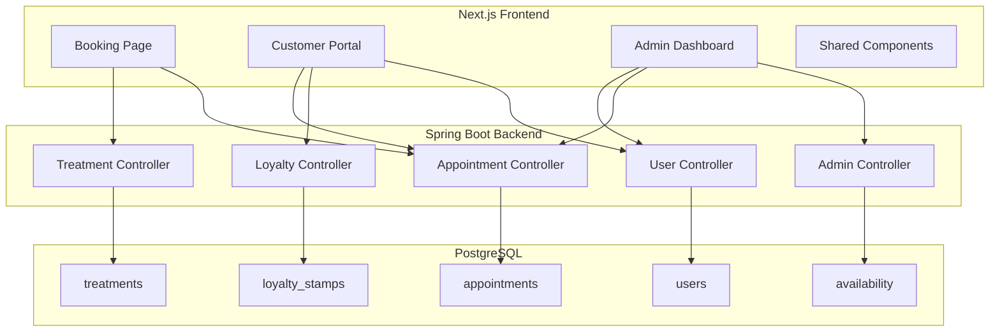

# Design Document

## Overview

The LM Beauty Booking System is a premium, full-stack application providing an immersive booking experience, personalized customer portal, loyalty program, and administrative dashboard. The system is built with Next.js 14 (frontend) and Spring Boot (backend), using Once UI components exclusively for a cohesive, feminine aesthetic.

## Architecture



## Components and Interfaces

### Frontend Components

#### 1. Booking Flow Components

```
/src/components/booking/
├── BookingHero.tsx              # Animated hero with category selection
├── BookingHero.module.scss
├── TreatmentSelector.tsx        # Treatment cards with imagery
├── TreatmentSelector.module.scss
├── TreatmentCard.tsx            # Individual treatment with TiltFx
├── TreatmentCard.module.scss
├── DateSelector.tsx             # Interactive calendar component
├── DateSelector.module.scss
├── TimeSlotGrid.tsx             # Available time slots display
├── TimeSlotGrid.module.scss
├── BookingSummary.tsx           # Confirmation and customer form
├── BookingSummary.module.scss
├── BookingSuccess.tsx           # Success animation and details
├── BookingSuccess.module.scss
├── BookingProgress.tsx          # Step indicator with animations
├── BookingProgress.module.scss
└── index.ts
```

#### 2. Customer Portal Components

```
/src/components/portal/
├── PortalLayout.tsx             # Main layout with SegmentedControl
├── PortalLayout.module.scss
├── WelcomeHero.tsx              # Personalized greeting section
├── WelcomeHero.module.scss
├── StampCard.tsx                # Loyalty stamp card visualization
├── StampCard.module.scss
├── AppointmentCard.tsx          # Upcoming/past appointment display
├── AppointmentCard.module.scss
├── AppointmentTimeline.tsx      # Treatment history timeline
├── AppointmentTimeline.module.scss
├── QuickActions.tsx             # Action buttons grid
├── QuickActions.module.scss
├── RewardNotification.tsx       # Loyalty reward celebration
├── RewardNotification.module.scss
└── index.ts
```

#### 3. Admin Dashboard Components

```
/src/components/admin/
├── AdminLayout.tsx              # Dashboard layout with sidebar
├── AdminLayout.module.scss
├── DashboardOverview.tsx        # Summary metrics and today's view
├── DashboardOverview.module.scss
├── AppointmentCalendar.tsx      # Full calendar view
├── AppointmentCalendar.module.scss
├── CustomerList.tsx             # Searchable customer table
├── CustomerList.module.scss
├── CustomerProfile.tsx          # Detailed customer view
├── CustomerProfile.module.scss
├── AvailabilityManager.tsx      # Time blocking interface
├── AvailabilityManager.module.scss
├── AnalyticsDashboard.tsx       # Charts and metrics
├── AnalyticsDashboard.module.scss
└── index.ts
```

### Backend API Endpoints

#### Appointments API

| Method | Endpoint | Description |
|--------|----------|-------------|
| GET | /api/appointments | List appointments (with filters) |
| GET | /api/appointments/{id} | Get appointment details |
| POST | /api/appointments | Create new appointment |
| PUT | /api/appointments/{id} | Update appointment |
| DELETE | /api/appointments/{id} | Cancel appointment |
| GET | /api/appointments/user/{userId} | Get user's appointments |

#### Treatments API

| Method | Endpoint | Description |
|--------|----------|-------------|
| GET | /api/treatments | List all treatments |
| GET | /api/treatments/{id} | Get treatment details |
| GET | /api/treatments/category/{category} | Get treatments by category |

#### Availability API

| Method | Endpoint | Description |
|--------|----------|-------------|
| GET | /api/availability/slots | Get available time slots for date |
| GET | /api/availability/dates | Get available dates for month |
| POST | /api/availability/block | Block time slot (admin) |
| DELETE | /api/availability/block/{id} | Unblock time slot (admin) |

#### Loyalty API

| Method | Endpoint | Description |
|--------|----------|-------------|
| GET | /api/loyalty/user/{userId} | Get user's loyalty status |
| POST | /api/loyalty/stamp | Add stamp after appointment |
| POST | /api/loyalty/redeem | Redeem loyalty reward |
| GET | /api/loyalty/history/{userId} | Get loyalty history |

## Data Models

### Frontend Types

```typescript
// Treatment Types
interface Treatment {
  id: string;
  name: string;
  category: 'wimpern' | 'refill' | 'extras';
  description: string;
  duration: number;
  price: number;
  imageUrl?: string;
  beforeAfterImages?: { before: string; after: string }[];
}

// Appointment Types
interface Appointment {
  id: string;
  userId: string;
  treatmentId: string;
  treatment: Treatment;
  scheduledDate: string;
  scheduledTime: string;
  status: 'pending' | 'confirmed' | 'completed' | 'cancelled';
  notes?: string;
  createdAt: string;
}

// Loyalty Types
interface LoyaltyStatus {
  userId: string;
  currentStamps: number;
  totalStamps: number;
  availableReward: boolean;
  rewardDiscount: number;
  nextRewardAt: number;
}

// Time Slot Types
interface TimeSlot {
  time: string;
  available: boolean;
  appointmentId?: string;
}

// Booking Form Types
interface BookingFormData {
  treatmentId: string;
  date: string;
  time: string;
  customerName: string;
  customerEmail: string;
  customerPhone?: string;
  notes?: string;
  applyLoyaltyReward?: boolean;
}
```

### Backend Entities

```java
// Appointment Entity
@Entity
@Table(name = "appointments")
public class Appointment {
    @Id
    @GeneratedValue(strategy = GenerationType.UUID)
    private String id;
    
    @ManyToOne
    @JoinColumn(name = "user_id")
    private User user;
    
    @ManyToOne
    @JoinColumn(name = "treatment_id")
    private Treatment treatment;
    
    private LocalDate scheduledDate;
    private LocalTime scheduledTime;
    
    @Enumerated(EnumType.STRING)
    private AppointmentStatus status;
    
    private String notes;
    private BigDecimal finalPrice;
    private Boolean loyaltyRewardApplied;
    
    private LocalDateTime createdAt;
    private LocalDateTime updatedAt;
}

// LoyaltyStamp Entity
@Entity
@Table(name = "loyalty_stamps")
public class LoyaltyStamp {
    @Id
    @GeneratedValue(strategy = GenerationType.UUID)
    private String id;
    
    @ManyToOne
    @JoinColumn(name = "user_id")
    private User user;
    
    @ManyToOne
    @JoinColumn(name = "appointment_id")
    private Appointment appointment;
    
    private LocalDateTime earnedAt;
    private Boolean redeemed;
    private LocalDateTime redeemedAt;
}

// Availability Entity
@Entity
@Table(name = "availability_blocks")
public class AvailabilityBlock {
    @Id
    @GeneratedValue(strategy = GenerationType.UUID)
    private String id;
    
    private LocalDate date;
    private LocalTime startTime;
    private LocalTime endTime;
    private String reason;
    
    private LocalDateTime createdAt;
}
```

## Error Handling

### Frontend Error States

1. **Network Errors**: Display retry button with friendly message
2. **Validation Errors**: Inline field validation with Once UI Input error states
3. **Booking Conflicts**: Show alternative time slots
4. **Authentication Errors**: Redirect to login with return URL

### Backend Error Responses

```json
{
  "success": false,
  "error": {
    "code": "SLOT_UNAVAILABLE",
    "message": "Der gewählte Termin ist leider nicht mehr verfügbar.",
    "suggestions": ["10:30", "11:00", "14:00"]
  }
}
```

## Testing Strategy

### Frontend Testing

1. **Component Tests**: Jest + React Testing Library for all booking components
2. **Integration Tests**: Cypress for complete booking flow
3. **Visual Regression**: Chromatic for design consistency

### Backend Testing

1. **Unit Tests**: JUnit 5 for service layer
2. **Integration Tests**: Spring Boot Test for API endpoints
3. **Load Tests**: JMeter for availability endpoint performance

## Visual Design Specifications

### Color Palette (from theme.ts)

- Primary Pink: #C4607A
- Secondary Pink: #D4708A
- Light Pink: #E8A4B8
- Pale Pink: #FFF0F4
- Background Warm: #FFF8F5
- Text Dark: #2D2A26
- Text Medium: #5A5550
- Text Light: #8A8580

### Animation Specifications

- **Page Transitions**: RevealFx with 400ms duration, translateY: 20px
- **Card Hover**: TiltFx with intensity: 3, scale: 1.02
- **Button Hover**: Animation with scale: 0.98, duration: 150ms
- **Success State**: Confetti animation + scale bounce

### Responsive Breakpoints

- Mobile: < 640px
- Tablet: 640px - 1024px
- Desktop: > 1024px
