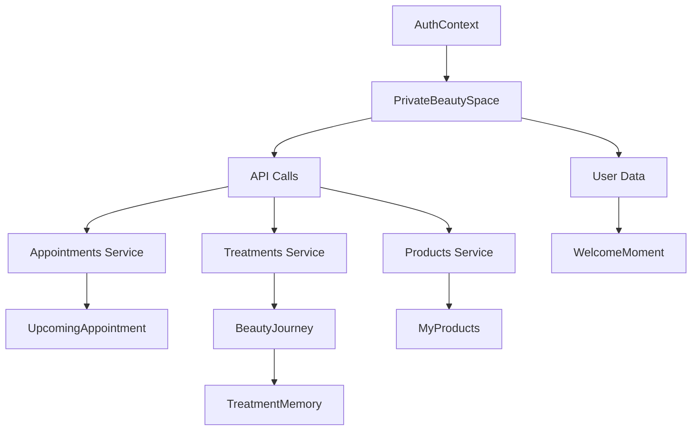

# Design Document: Private Beauty Space

## Overview

The Private Beauty Space is a personal user area designed as an intimate, journal-like experience for authenticated LM Beauty customers. It deliberately avoids dashboard conventions, instead creating a calm sanctuary that feels like entering a private studio room or opening a personal beauty journal.

The design philosophy centers on emotional connection over functional efficiency. Every element serves to make the user feel recognized, cared for, and emotionally attached to their beauty journey.

## Architecture

### Page Structure

```
/mein-bereich (My Space)
├── PrivateBeautySpace.tsx (Main page component)
├── PrivateBeautySpace.module.scss (Styles)
└── components/
    ├── WelcomeMoment.tsx
    ├── BeautyJourney.tsx
    ├── TreatmentMemory.tsx
    ├── UpcomingAppointment.tsx
    ├── MyProducts.tsx
    └── GentleGuidance.tsx
```

### Data Flow



### Route Protection

The page uses Next.js middleware or a client-side redirect pattern to ensure only authenticated users can access the space. Unauthenticated users are redirected to `/anmelden` (login).

## Components and Interfaces

### PrivateBeautySpace (Main Container)

The root component orchestrates the vertical narrative flow and manages data fetching.

```tsx
interface PrivateBeautySpaceProps {
  // No props - uses AuthContext internally
}
```

Layout structure using Once UI:
- Single `Column` with `fillWidth` and generous `gap="64"` or `gap="80"`
- `paddingX` and `paddingY` for breathing room
- No sidebars, no grid layouts
- Sections flow vertically like journal pages

### WelcomeMoment

Creates the personalized greeting experience.

```tsx
interface WelcomeMomentProps {
  firstName?: string;
  profileImage?: string;
}
```

Visual composition:
- Soft `Avatar` display (optional, if user has profile image)
- `Heading` with `variant="display-default-l"` for the greeting
- `Text` with `onBackground="neutral-weak"` for the subtext
- Center-aligned, generous vertical padding
- Subtle fade-in animation on mount

Copy examples:
- "Hallo, [Name]" or "Schön, dass du da bist"
- Subtext: "Dein persönlicher Beauty-Raum"

### BeautyJourney

Displays past treatments as meaningful memories.

```tsx
interface BeautyJourneyProps {
  treatments: TreatmentMemory[];
  onViewMore?: () => void;
}

interface TreatmentMemory {
  id: string;
  treatmentName: string;
  date: Date;
  notes?: string;
}
```

Visual composition:
- Section heading: "Deine Beauty-Reise" or "Deine Behandlungen"
- Vertical stack of `TreatmentMemory` components
- Maximum 5 visible, soft "Mehr anzeigen" link if more exist
- Empty state with encouraging message

### TreatmentMemory

A single treatment displayed as an emotional moment.

```tsx
interface TreatmentMemoryProps {
  treatmentName: string;
  date: Date;
  notes?: string;
}
```

Visual composition:
- Soft container with `radius="l"` and subtle background
- Treatment name as primary text
- Relative date: "vor 2 Wochen" using date-fns or similar
- Optional notes in lighter text
- No borders, no card-like appearance
- Generous internal padding

### UpcomingAppointment

Presents the next appointment as something to look forward to.

```tsx
interface UpcomingAppointmentProps {
  appointment?: {
    id: string;
    treatmentName: string;
    date: Date;
    time: string;
  };
  onViewDetails?: () => void;
  onReschedule?: () => void;
}
```

Visual composition:
- Emotionally framed heading: "Dein nächster Termin wartet auf dich"
- Date displayed warmly: "Freitag, 10. Januar" + "in 5 Tagen"
- Treatment name and time
- Soft CTA buttons using `Button variant="tertiary"` or `variant="secondary"`
- Empty state: gentle invitation to book

### MyProducts

Displays purchased products as curated personal items.

```tsx
interface MyProductsProps {
  products: {
    id: string;
    name: string;
    imageUrl?: string;
  }[];
}
```

Visual composition:
- Section heading: "Deine Produkte"
- Horizontal scroll or soft grid (2 columns max on mobile)
- Product images with rounded corners
- Product names in soft typography
- No prices, no order numbers, no transaction details
- Hidden entirely if no products

### GentleGuidance

Subtle care tips and reminders.

```tsx
interface GentleGuidanceProps {
  tips: {
    id: string;
    title: string;
    content: string;
    icon?: string;
  }[];
}
```

Visual composition:
- Maximum 2 tips visible
- Soft, integrated styling (not card-like)
- Supportive language, no urgency
- Optional soft icon using `Icon` component
- Blends seamlessly with journal aesthetic

## Data Models

### User (Extended from existing)

```typescript
interface User {
  id: string;
  firstName?: string;
  lastName?: string;
  profileImage?: string;
  // ... existing fields
}
```

### Treatment History

```typescript
interface TreatmentHistory {
  id: string;
  userId: string;
  treatmentId: string;
  treatmentName: string;
  completedAt: Date;
  notes?: string;
  staffMember?: string;
}
```

### Appointment

```typescript
interface Appointment {
  id: string;
  userId: string;
  treatmentId: string;
  treatmentName: string;
  scheduledDate: Date;
  scheduledTime: string;
  status: 'scheduled' | 'completed' | 'cancelled';
}
```

### Product Purchase

```typescript
interface ProductPurchase {
  id: string;
  userId: string;
  productId: string;
  productName: string;
  productImageUrl?: string;
  purchasedAt: Date;
}
```

### Care Tip

```typescript
interface CareTip {
  id: string;
  title: string;
  content: string;
  icon?: string;
  relevantTreatments?: string[];
}
```

## Error Handling

### Loading States

- Use a calm, branded loading experience
- Soft `Spinner` centered on page with brand colors
- Optional: skeleton placeholders that match the journal aesthetic
- No aggressive loading indicators

### Empty States

Each section handles empty data gracefully:
- **No treatments**: "Deine Beauty-Reise beginnt bald..."
- **No appointment**: "Bereit für deinen nächsten Termin?"
- **No products**: Section hidden entirely
- **No tips**: Section hidden or shows generic welcome tip

### Error States

- Soft error messages, never alarming
- Retry options presented gently
- Fallback to cached data where possible

## Testing Strategy

### Unit Tests

- Component rendering with various prop combinations
- Empty state rendering
- Date formatting utilities (relative dates)
- Authentication redirect logic

### Integration Tests

- Data fetching and display flow
- Navigation between sections
- Authentication state changes

### Visual Regression Tests

- Ensure no dashboard-like elements appear
- Verify spacing and breathing room
- Check responsive behavior

### Accessibility Tests

- Screen reader compatibility
- Keyboard navigation
- Color contrast compliance
- Focus management

## Visual Design Specifications

### Color Usage

Following the existing theme:
- Background: Warm whites (`#FFF8F5`, `#FFFBF8`)
- Text: `colors.text.dark` for headings, `colors.text.medium` for body
- Accents: `colors.pink.medium` for subtle highlights
- No harsh contrasts

### Typography

- Headings: `display-default-l` or `heading-default-m`
- Body: `body-default-m`
- Labels: `label-default-s`
- All text uses the Merriweather Sans font family

### Spacing

- Section gaps: `64px` to `80px`
- Internal padding: `24px` to `32px`
- Element gaps: `16px` to `24px`
- Generous breathing room throughout

### Borders and Surfaces

- No hard borders
- Soft `radius="l"` or `radius="xl"` on containers
- Subtle backgrounds using `background="neutral-alpha-weak"` or custom warm tones
- No card shadows that create harsh separation

### Motion

- Fade-in on mount: `opacity 0 → 1` over `400ms`
- Subtle hover states: `opacity` or `transform: translateY(-2px)`
- No bouncing, no flashy effects
- Respect `prefers-reduced-motion`

## Responsive Behavior

### Desktop (1024px+)

- Maximum content width: `800px` centered
- Generous horizontal padding
- Full breathing room

### Tablet (768px - 1023px)

- Slightly reduced padding
- Same vertical flow
- Products may show 2 columns

### Mobile (< 768px)

- Full-width with `16px` horizontal padding
- Increased vertical gaps for thumb scrolling
- Touch-friendly tap targets (44x44px minimum)
- Products in single column or horizontal scroll

## File Structure

```
lmbeauty-frontend/src/
├── app/
│   └── mein-bereich/
│       └── page.tsx
├── components/
│   └── private-space/
│       ├── PrivateBeautySpace.tsx
│       ├── PrivateBeautySpace.module.scss
│       ├── WelcomeMoment.tsx
│       ├── BeautyJourney.tsx
│       ├── TreatmentMemory.tsx
│       ├── UpcomingAppointment.tsx
│       ├── MyProducts.tsx
│       ├── GentleGuidance.tsx
│       └── index.ts
├── lib/
│   └── services.ts (extended with new API calls)
└── types/
    └── index.ts (extended with new interfaces)
```
