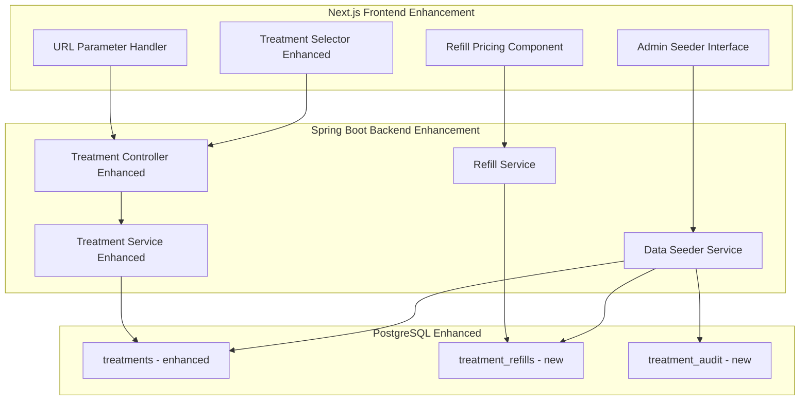

# Design Document

## Overview

The Treatment Data Enhancement system extends the existing LM Beauty booking platform with URL parameter support, accurate treatment pricing, and a comprehensive refill management system. The design focuses on seamless integration with the existing Spring Boot backend and Next.js frontend while maintaining the premium user experience.

## Architecture



## Components and Interfaces

### Frontend Enhancements

#### 1. URL Parameter Handling

```typescript
// /src/hooks/useServicePreselection.ts
interface ServiceMapping {
  einzeltechnik: string[];
  refill: string[];
  hybrid: string[];
  volumen: string[];
  liftings: string[];
  feinschliff: string[];
}

interface UseServicePreselectionReturn {
  preselectedCategory: string | null;
  preselectedTreatments: Treatment[];
  isValidService: boolean;
}
```

#### 2. Enhanced Treatment Components

```
/src/components/booking/enhanced/
├── ServicePreloader.tsx         # Handles URL parameter logic
├── ServicePreloader.module.scss
├── RefillPricingCard.tsx        # Displays time-based refill options
├── RefillPricingCard.module.scss
├── TreatmentWithRefills.tsx     # Treatment card with refill pricing
├── TreatmentWithRefills.module.scss
└── index.ts
```

#### 3. Admin Treatment Management

```
/src/components/admin/treatments/
├── TreatmentManager.tsx         # Main treatment management interface
├── TreatmentManager.module.scss
├── TreatmentForm.tsx            # Add/edit treatment form
├── TreatmentForm.module.scss
├── RefillPricingForm.tsx        # Refill pricing configuration
├── RefillPricingForm.module.scss
├── DataSeederInterface.tsx      # Seed database with correct data
├── DataSeederInterface.module.scss
└── index.ts
```

### Backend Enhancements

#### Enhanced Treatment Entity

```java
@Entity
@Table(name = "treatments")
public class Treatment {
    @Id
    @GeneratedValue(strategy = GenerationType.UUID)
    private String id;
    
    private String name;
    private String category;
    private String description;
    private Integer duration; // in minutes
    private BigDecimal price;
    private String imageUrl;
    
    // New fields for URL parameter mapping
    private String urlSlug; // e.g., "einzeltechnik", "hybrid"
    private Boolean hasRefillOptions;
    
    @OneToMany(mappedBy = "treatment", cascade = CascadeType.ALL)
    private List<TreatmentRefill> refillOptions;
    
    private LocalDateTime createdAt;
    private LocalDateTime updatedAt;
}
```

#### New TreatmentRefill Entity

```java
@Entity
@Table(name = "treatment_refills")
public class TreatmentRefill {
    @Id
    @GeneratedValue(strategy = GenerationType.UUID)
    private String id;
    
    @ManyToOne
    @JoinColumn(name = "treatment_id")
    private Treatment treatment;
    
    private Integer weekThreshold; // 2, 3, etc.
    private BigDecimal price;
    private String description; // "2 wochen", "3 wochen"
    
    private LocalDateTime createdAt;
}
```

#### Treatment Audit Entity

```java
@Entity
@Table(name = "treatment_audit")
public class TreatmentAudit {
    @Id
    @GeneratedValue(strategy = GenerationType.UUID)
    private String id;
    
    private String treatmentId;
    private String action; // CREATE, UPDATE, DELETE
    private String fieldChanged;
    private String oldValue;
    private String newValue;
    private String adminUserId;
    
    private LocalDateTime timestamp;
}
```

### API Enhancements

#### Enhanced Treatment Endpoints

| Method | Endpoint | Description |
|--------|----------|-------------|
| GET | /api/treatments?service={slug} | Get treatments by URL slug |
| GET | /api/treatments/{id}/refills | Get refill options for treatment |
| POST | /api/treatments/{id}/refills | Add refill pricing (admin) |
| PUT | /api/treatments/{id}/refills/{refillId} | Update refill pricing (admin) |
| DELETE | /api/treatments/{id}/refills/{refillId} | Remove refill option (admin) |

#### New Refill Calculation Endpoint

| Method | Endpoint | Description |
|--------|----------|-------------|
| GET | /api/refills/calculate?userId={id}&treatmentId={id} | Calculate refill eligibility and pricing |

#### Data Seeding Endpoints

| Method | Endpoint | Description |
|--------|----------|-------------|
| POST | /api/admin/seed/treatments | Seed database with correct treatment data |
| GET | /api/admin/seed/status | Get seeding status and validation |
| POST | /api/admin/seed/rollback | Rollback to previous treatment data |

## Data Models

### Frontend Types

```typescript
// Enhanced Treatment Types
interface Treatment {
  id: string;
  name: string;
  category: string;
  description: string;
  duration: number;
  price: number;
  imageUrl?: string;
  urlSlug: string;
  hasRefillOptions: boolean;
  refillOptions?: RefillOption[];
}

interface RefillOption {
  id: string;
  weekThreshold: number;
  price: number;
  description: string;
}

interface RefillEligibility {
  isEligible: boolean;
  weeksSinceLastAppointment?: number;
  availableRefills: RefillOption[];
  recommendedOption?: RefillOption;
  lastAppointmentDate?: string;
}

// URL Parameter Types
interface ServicePreselection {
  service: string;
  isValid: boolean;
  matchedTreatments: Treatment[];
  category?: string;
}
```

### Service Mapping Configuration

```typescript
// /src/config/serviceMapping.ts
export const SERVICE_MAPPING = {
  einzeltechnik: {
    category: 'wimpern',
    treatmentSlugs: ['einzeltechnik'],
    displayName: 'Einzeltechnik'
  },
  refill: {
    category: 'refill',
    treatmentSlugs: ['hybrid-refill', 'volumen-refill'],
    displayName: 'Refill Termine'
  },
  hybrid: {
    category: 'wimpern',
    treatmentSlugs: ['hybrid'],
    displayName: 'Hybrid'
  },
  volumen: {
    category: 'wimpern',
    treatmentSlugs: ['volumen'],
    displayName: 'Volumen'
  },
  liftings: {
    category: 'liftings',
    treatmentSlugs: ['wimpernlifting', 'augenbraunlifting', 'lifting-kombi'],
    displayName: 'Liftings'
  },
  feinschliff: {
    category: 'extras',
    treatmentSlugs: ['augenbrauen-zupfen', 'augenbrauen-faerben', 'shellac-naegel'],
    displayName: 'Feinschliff'
  }
} as const;
```

## Implementation Details

### 1. URL Parameter Processing

```typescript
// /src/hooks/useServicePreselection.ts
export function useServicePreselection() {
  const searchParams = useSearchParams();
  const service = searchParams.get('service');
  
  const preselection = useMemo(() => {
    if (!service) return null;
    
    const mapping = SERVICE_MAPPING[service as keyof typeof SERVICE_MAPPING];
    if (!mapping) return null;
    
    return {
      service,
      category: mapping.category,
      treatmentSlugs: mapping.treatmentSlugs,
      displayName: mapping.displayName
    };
  }, [service]);
  
  return preselection;
}
```

### 2. Refill Calculation Logic

```java
@Service
public class RefillCalculationService {
    
    public RefillEligibility calculateRefillEligibility(String userId, String treatmentId) {
        // Find last completed appointment for this treatment type
        Optional<Appointment> lastAppointment = appointmentRepository
            .findLastCompletedByUserAndTreatment(userId, treatmentId);
            
        if (lastAppointment.isEmpty()) {
            return RefillEligibility.builder()
                .isEligible(false)
                .availableRefills(Collections.emptyList())
                .build();
        }
        
        long weeksSince = ChronoUnit.WEEKS.between(
            lastAppointment.get().getScheduledDate(),
            LocalDate.now()
        );
        
        Treatment treatment = treatmentService.findById(treatmentId);
        List<TreatmentRefill> eligibleRefills = treatment.getRefillOptions()
            .stream()
            .filter(refill -> weeksSince <= refill.getWeekThreshold())
            .sorted(Comparator.comparing(TreatmentRefill::getWeekThreshold))
            .collect(Collectors.toList());
            
        return RefillEligibility.builder()
            .isEligible(!eligibleRefills.isEmpty())
            .weeksSinceLastAppointment((int) weeksSince)
            .availableRefills(eligibleRefills)
            .recommendedOption(eligibleRefills.isEmpty() ? null : eligibleRefills.get(0))
            .lastAppointmentDate(lastAppointment.get().getScheduledDate())
            .build();
    }
}
```

### 3. Data Seeding Service

```java
@Service
public class TreatmentDataSeederService {
    
    @Transactional
    public void seedTreatmentData() {
        // Clear existing data with backup
        backupExistingData();
        
        // Seed Einzeltechnik
        createTreatment("Einzeltechnik", "wimpern", "einzeltechnik", 75.00, 90, false);
        
        // Seed Hybrid with refills
        Treatment hybrid = createTreatment("Hybrid", "wimpern", "hybrid", 85.00, 120, true);
        addRefillOption(hybrid, 2, 35.00, "2 wochen");
        addRefillOption(hybrid, 3, 40.00, "3 wochen");
        
        // Seed Volumen with refills
        Treatment volumen = createTreatment("Volumen", "wimpern", "volumen", 110.00, 150, true);
        addRefillOption(volumen, 2, 50.00, "2 wochen");
        addRefillOption(volumen, 3, 55.00, "3 wochen");
        
        // Seed Liftings
        createTreatment("Wimpernlifting", "liftings", "wimpernlifting", 49.00, 60, false);
        createTreatment("Augenbraunlifting", "liftings", "augenbraunlifting", 49.00, 45, false);
        createTreatment("Lifting Kombi Paket", "liftings", "lifting-kombi", 85.00, 90, false);
        
        // Seed Feinschliff
        createTreatment("Augenbrauen zupfen", "extras", "augenbrauen-zupfen", 10.00, 15, false);
        createTreatment("Augenbrauen färben", "extras", "augenbrauen-faerben", 10.00, 20, false);
        createTreatment("Shellac Nägel", "extras", "shellac-naegel", 35.00, 45, false);
        
        auditService.logSeeding("TREATMENT_DATA_SEEDED", getCurrentUser());
    }
    
    private Treatment createTreatment(String name, String category, String slug, 
                                    double price, int duration, boolean hasRefills) {
        Treatment treatment = Treatment.builder()
            .name(name)
            .category(category)
            .urlSlug(slug)
            .price(BigDecimal.valueOf(price))
            .duration(duration)
            .hasRefillOptions(hasRefills)
            .createdAt(LocalDateTime.now())
            .build();
            
        return treatmentRepository.save(treatment);
    }
}
```

## Error Handling

### Frontend Error States

1. **Invalid Service Parameter**: Show all treatments with notification
2. **Refill Calculation Error**: Fall back to full pricing
3. **Seeding Errors**: Display detailed error messages to admin

### Backend Error Responses

```json
{
  "success": false,
  "error": {
    "code": "INVALID_SERVICE_PARAMETER",
    "message": "Der angegebene Service-Parameter ist ungültig.",
    "validServices": ["einzeltechnik", "hybrid", "volumen", "liftings", "feinschliff"]
  }
}
```

## Testing Strategy

### Frontend Testing

1. **URL Parameter Tests**: Jest tests for service preselection logic
2. **Refill Component Tests**: React Testing Library for pricing display
3. **Integration Tests**: Cypress for complete booking flow with parameters

### Backend Testing

1. **Refill Calculation Tests**: JUnit tests for week-based pricing logic
2. **Seeding Tests**: Integration tests for data seeding accuracy
3. **API Tests**: Spring Boot Test for enhanced endpoints

## Migration Strategy

### Database Migration

```sql
-- Add new columns to treatments table
ALTER TABLE treatments ADD COLUMN url_slug VARCHAR(50);
ALTER TABLE treatments ADD COLUMN has_refill_options BOOLEAN DEFAULT FALSE;

-- Create treatment_refills table
CREATE TABLE treatment_refills (
    id UUID PRIMARY KEY DEFAULT gen_random_uuid(),
    treatment_id UUID REFERENCES treatments(id),
    week_threshold INTEGER NOT NULL,
    price DECIMAL(10,2) NOT NULL,
    description VARCHAR(100),
    created_at TIMESTAMP DEFAULT CURRENT_TIMESTAMP
);

-- Create audit table
CREATE TABLE treatment_audit (
    id UUID PRIMARY KEY DEFAULT gen_random_uuid(),
    treatment_id UUID,
    action VARCHAR(20) NOT NULL,
    field_changed VARCHAR(50),
    old_value TEXT,
    new_value TEXT,
    admin_user_id UUID,
    timestamp TIMESTAMP DEFAULT CURRENT_TIMESTAMP
);
```

### Data Migration Steps

1. **Backup existing treatment data**
2. **Run database schema migration**
3. **Execute treatment data seeding**
4. **Validate seeded data accuracy**
5. **Update frontend to use new API endpoints**